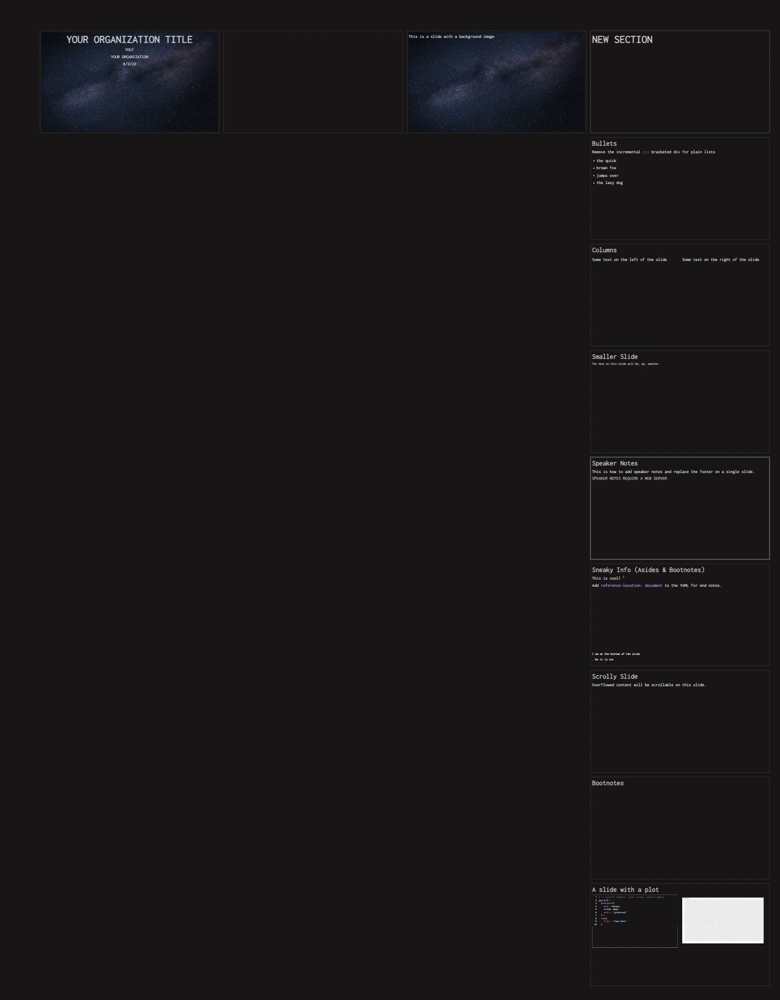

# Easily Customizable Quarto Template 



A base Quarto template with all the SCSS you need as well as a helpful base qmd with many example slides for cut/paste.

- Clone this repo
- Delete `.git`
- Delete `preview.png`
- $ `git init`
- $ `git add -A`
- $ `git commit -m 'saving the base'`
- Rename the `_extensions/` **`organization`** to some easy to type name.
- Edit `_extensions/_extension.yml` and make changes to the (ugh) YAML.
  - NOTE: if you add/change included assets/resources, make sure to modify `format-resources` in the YAML
- Replace `_extensions/logo.png` with your logo
- Replace `_extensions/space.jpg` with a background image (add more if you want easily available ones)
- Edit `_extensions/theme.scss`. It's a full theme. Modify background/foreground/etc colors at-will.

In `template.qmd` change:

```
format:
  organization-revealjs:
```

and replace `organization` to the easy to type name above.

### Use What You Made!

Assuming `quarto-organization-template` is is in your current directory…

```
mkdir samplepres && \
  cd samplepres && \
  quarto use template --no-prompt ../quarto-organization-template && 
  quarto render samplepres.qmd && \
  open *html
```

You can also `quarto use template hrbrmstr/quarto-organization-template` and customize it on-the-fly.

Slide Background Photo by Pixabay: https://www.pexels.com/photo/photo-of-galaxy-207529/